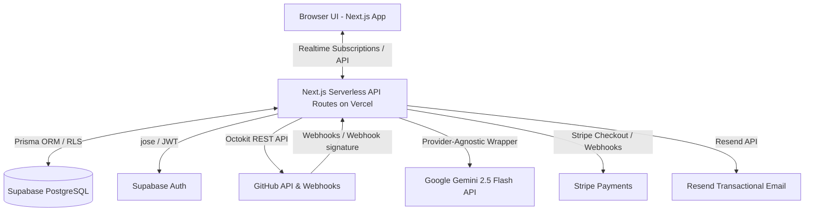
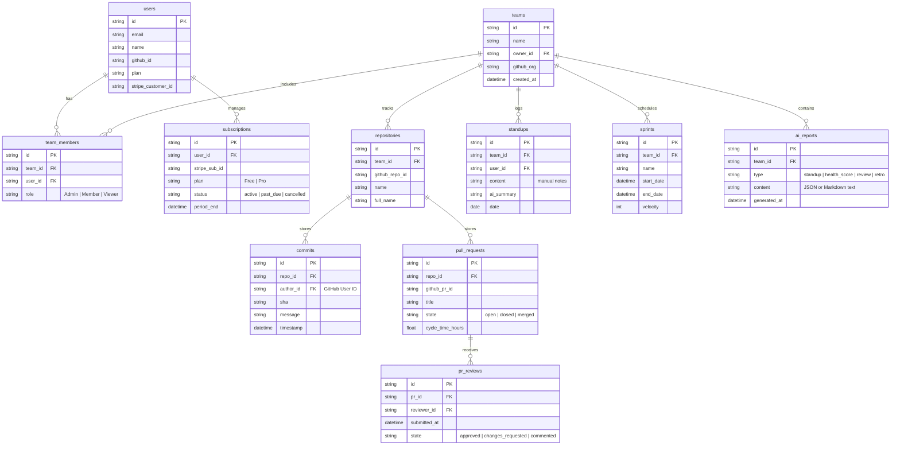
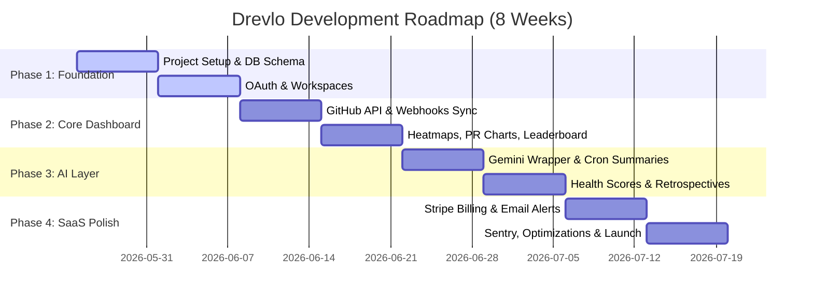

# Drevlo SRS Analysis Report

This document presents a comprehensive analysis and breakdown of the **Drevlo** Software Requirements Specification (SRS v1.0) draft. 

Drevlo is a full-stack developer productivity and team analytics SaaS dashboard that ingests raw GitHub activity, processes it using Next.js and Supabase, and uses the **Google Gemini 2.5 Flash API** to generate standup summaries, code review insights, team health scores, and sprint retrospective reports.

---

## 🏗️ 1. Architecture & Data Flow

Drevlo is designed as a standalone web application hosted on Vercel with a managed Supabase backend. Below is the system-level data flow diagram:

### Key Integration Points
* **GitHub Integration:** GitHub OAuth for login and Octokit for data syncing. Push, PR, and review events trigger webhook endpoints verified using an HMAC-SHA256 signature.
* **AI Engine:** Google Gemini 2.5 Flash API key managed server-side. Wrapper class in `lib/ai.ts` is provider-agnostic for easy migration to other models (e.g., Claude or GPT).
* **Billing System:** Stripe Checkout for pricing tiers with database updates handled via verified Stripe webhooks.

---

## 🗄️ 2. Database Schema & ERD

Drevlo uses a PostgreSQL database managed by Supabase, queried via the **Prisma ORM**. Row Level Security (RLS) is enforced at the database level so users can only access their own team's data.

---

## 🛠️ 3. Technology Stack Breakdown

The stack is modern, type-safe, and designed for optimal performance on a serverless infrastructure:

| Tier | Technology | Version | Key Rationale & Usage |
| :--- | :--- | :--- | :--- |
| **Frontend** | **Next.js** | `14.x (App Router)` | Combines React 18, SSR, and API routes. |
| | **TypeScript** | `5.x` | Codebase-wide strict mode typing. |
| | **Tailwind CSS** | `3.x` | Rapid custom styling and responsive design. |
| | **shadcn/ui** | `Latest` | Modular, accessible UI components (buttons, dialogs, forms). |
| | **Recharts** | `2.x` | Visualizing commit heatmaps, cycle times, and velocity. |
| | **React Query** | `5.x` | Frontend server state caching and optimistic updates. |
| | **Zustand** | `4.x` | Lightweight client state management (sidebar status, filter state). |
| **Backend** | **Next.js API Routes** | `14.x` | Serverless endpoints, REST API functionality. |
| | **Supabase** | `Latest` | PostgreSQL, Supabase Auth, Realtime listeners for charts. |
| | **Prisma** | `5.x` | Type-safe ORM for structured database operations. |
| | **Zod** | `3.x` | Input schema validation on API routes (anti-XSS/SQL injection). |
| | **node-cron / jose** | `3.x / 5.x` | Scheduled jobs and JWT verification. |
| **AI Layer** | **Google Gemini API** | `gemini-2.5-flash` | Powering AI insights. Free tier: 15 RPM, 1M TPM. |
| | **SDK** | `@google/generative-ai` | Official Google Generative AI SDK for Node.js. |

---

## 🔌 4. API Endpoints Map

All client-to-server operations occur over HTTPS via the following endpoint registry:

### 🔑 Authentication (`/api/auth`)
* `GET /api/auth/github` - Initiates GitHub OAuth 2.0 flow (Auth Required: **No**)
* `GET /api/auth/callback` - Handles callback and issues a 7-day JWT cookie (Auth Required: **No**)
* `POST /api/auth/logout` - Clears the session JWT (Auth Required: **Yes**)
* `GET /api/auth/me` - Returns current user details (Auth Required: **Yes**)

### 👥 Teams (`/api/teams`)
* `POST /api/teams` - Create a team workspace (Auth Required: **Yes**)
* `GET /api/teams/:id` - Fetch team metadata (Auth Required: **Yes (Member+)**)
* `PATCH /api/teams/:id` - Update team configuration (Auth Required: **Yes (Admin)**)
* `POST /api/teams/:id/invite` - Send member invitation via email (Auth Required: **Yes (Admin)**)
* `DELETE /api/teams/:id/members/:uid` - Revoke member access (Auth Required: **Yes (Admin)**)

### 📈 GitHub Sync & Analytics (`/api/github` & `/api/analytics`)
* `POST /api/github/connect` - Links a GitHub Organization to the team (Auth Required: **Yes (Admin)**)
* `POST /api/github/sync` - Forces database/GitHub manual synchronization (Auth Required: **Yes (Admin)**)
* `GET /api/analytics/commits` - Fetches filtered commit metrics and heatmap data (Auth Required: **Yes**)
* `GET /api/analytics/prs` - Fetches PR cycle times (avg, p50, p90) and merge rates (Auth Required: **Yes**)
* `GET /api/analytics/leaderboard` - Ranks developers by activity metrics (Auth Required: **Yes**)

### 🤖 AI & Daily Standups (`/api/standups` & `/api/ai`)
* `POST /api/standups` - Submits a developer's daily standup form (Auth Required: **Yes (Member+)**)
* `GET /api/standups` - Fetches historical standups for the current team (Auth Required: **Yes**)
* `POST /api/ai/standup-summary` - Daily cron job (9:00 AM UTC) to generate summaries (Auth Required: **Yes (Cron token)**)
* `GET /api/ai/health-score` - Computes/retrieves weekly team health score (0-100) (Auth Required: **Yes**)
* `POST /api/ai/retro` - Generates sprint retrospective report (Auth Required: **Yes (Admin)**)

### 💳 Webhooks & Stripe Billing (`/api/webhooks` & `/api/billing`)
* `POST /api/webhooks/github` - Ingests push, PR, and review events (Auth Required: **Signature Check**)
* `POST /api/webhooks/stripe` - Handles payment and cancellation events (Auth Required: **Signature Check**)
* `GET /api/billing/plans` - Retrieves SaaS plan structures (Auth Required: **No**)
* `POST /api/billing/checkout` - Redirects to Stripe hosted checkout (Auth Required: **Yes**)
* `POST /api/billing/portal` - Redirects to Stripe Customer Billing Portal (Auth Required: **Yes**)

---

## ⚡ 5. Analysis of AI Layer & Rate Limit Management

A critical constraint in the SRS is the utilization of the **Google Gemini 2.5 Flash free tier (15 RPM / 1M TPM)**.

### The AI Optimization Strategy:
1. **AI Report Caching:** All AI outputs (summaries, health scores, review notes, retros) are cached in `ai_reports` and `standups` database tables. A user requesting a report first queries the database. If it exists and is fresh (e.g., generated within the current sprint/week), the cached version is returned immediately to avoid redundant API hits.
2. **Queuing & Batching:** Since the free tier limit is 15 requests per minute, weekly health score calculations and end-of-sprint retrospectives cannot be executed in parallel for all teams. A backend job runner must serialize these calls, or use exponential backoff (`lib/ai.ts` wrapper logic) to ensure rate-limiting errors (429) do not break the UI.
3. **Provider-Agnostic Design:** Prompt templates are separate from execution logic (`/prompts` vs `/lib/ai.ts`). The wrapper reads `AI_PROVIDER` from environment variables, enabling a drop-in replacement of the underlying LLM.

---

## 🛡️ 6. Core Security Implementations

Adhering strictly to **Rule 01–04** and **NFR-06–11**:
* **Zero Client-Side Secrets:** Secrets like `GEMINI_API_KEY`, `STRIPE_SECRET_KEY`, and `SUPABASE_SERVICE_ROLE_KEY` will remain entirely server-side.
* **Database Row Level Security (RLS):** Every query dynamically inspects the JWT payload containing `team_id` or `user_id` to prevent IDOR (Insecure Direct Object Reference) vulnerabilities.
* **Webhook Verification:** Stripe webhooks are verified via signature validation (`stripe.webhooks.constructEvent`). GitHub webhooks validation uses HMAC-SHA256 signatures derived from `GITHUB_WEBHOOK_SECRET`.
* **Sanitization:** All markdown and HTML content submitted in standup forms is run through a sanitizer block before rendering to prevent Cross-Site Scripting (XSS).

---

## 🗺️ 7. 4-Phase Roadmap Breakdown

---

## ❓ 8. Initial Architectural Open Questions

Before starting Phase 1, the following points in the draft require clarification:
1. **Octokit Auth Model:** Will we register Drevlo as a **GitHub App** (recommended for webhooks and granular organization-wide access) or simple **OAuth Apps** using developer Personal Access Tokens (PATs)? A GitHub App provides cleaner org-wide repository access and installation flows.
2. **Real-time Syncing strategy:** Is the 30-minute cron job a fallback, or the primary engine? For an active team, webhooks should drive 95% of database updates, with the cron running as a reconciliation job.
3. **Standup Summary Trigger Time:** The SRS triggers standup summaries at 9:00 AM UTC. Depending on team time zones, does the workspace need a timezone configuration to trigger standup summaries at 9:00 AM *local* time instead of UTC?
